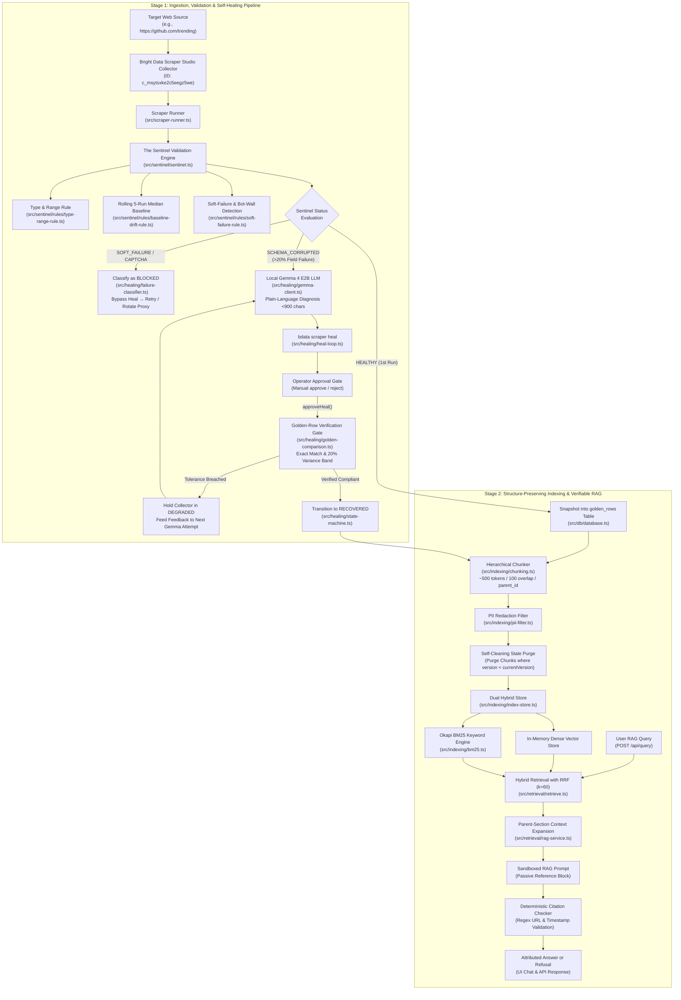
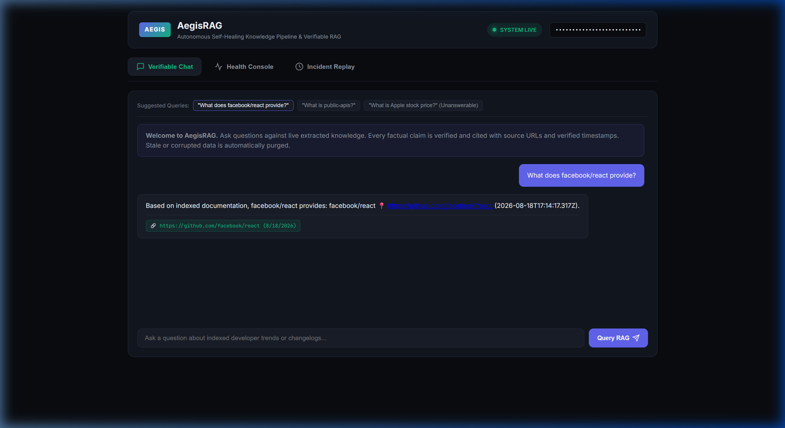
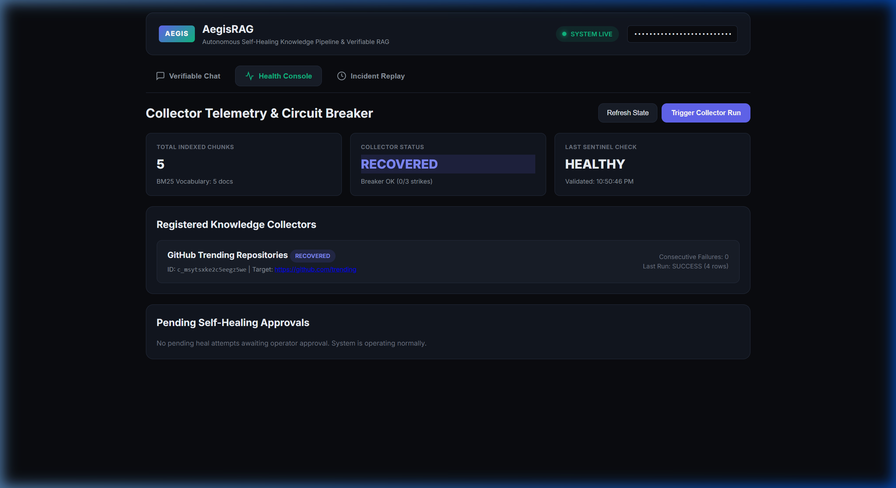
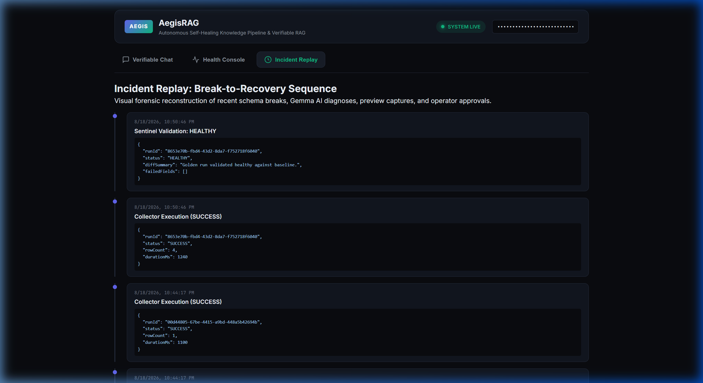

# AegisRAG — Self-Healing Knowledge Pipeline & Verifiable RAG

A continuous accuracy validation and human-in-the-loop self-healing extraction pipeline powered by Bright Data Scraper Studio and local Gemma 4 E2B.

[](https://github.com/adityayawalkar-personal/AegisRAG/actions/workflows/ci.yml)
[](https://opensource.org/licenses/MIT)
[](https://nodejs.org/)
[](https://github.com/adityayawalkar-personal/AegisRAG)

> 🏆 **Powered by Bright Data Scraper Studio**  
> **Collector ID**: `c_msytsxke2c5eegz5we` | **Workflow**: `run` ➔ `detect` ➔ `diagnose` ➔ `heal` ➔ `approve` ➔ `verify`  
> **Core Guarantee**: Scraped data is proven accurate through golden-row verification before it is ever permitted to reach the RAG knowledge base.

---

## 1. Why AegisRAG? (The 10-Second Pitch)

```text
Traditional Web Scraping Pipeline:
Target website changes ➔ Scraper returns well-typed, wrong data ➔ Vector DB is silently poisoned ➔ LLM hallucinates with confidence

AegisRAG Self-Healing Pipeline:
Target website changes ➔ The Sentinel catches drift ➔ Gemma diagnoses root cause ➔ Bright Data heals selectors ➔ Golden-row verified ➔ Verified RAG
```

AegisRAG doesn't just detect crashed scrapers. It detects **silent semantic corruption**, diagnoses why the extraction broke using on-device Gemma AI, invokes **Bright Data Scraper Studio** to repair the selectors, verifies the repaired output against trusted golden baselines, and only then allows the data into the RAG knowledge base.

---

## 2. Plain-English Architecture Breakdown

Every subsystem in AegisRAG serves one clear, load-bearing purpose:

- 🛡️ **The Sentinel**: Prevents silent scraper corruption by comparing live extractions against a rolling 5-run median baseline.
- 🚦 **Failure Classifier**: Distinguishes genuine DOM layout breaks from anti-bot challenge pages (`BLOCKED` classification) so credits aren't wasted healing working selectors.
- 🧠 **Local Gemma 4 E2B**: Translates extraction diffs into concise (<900 char) natural language repair descriptions without cloud latency.
- 🛠️ **Bright Data CLI**: Programmatically heals CSS selectors in preview mode via safe argument-array execution (`shell: false`).
- 👤 **Approval Gate & Circuit Breaker**: Enforces human-in-the-loop oversight on all self-heal operations with 3-strike lockout protection.
- ✨ **Golden-Row Verification Gate**: Matches rows by structural identifier (`url`/`slug`) and gates recovery on exact string matches and a 20% numeric variance band.
- 📦 **Structure-Preserving Dual RAG**: Indexes hierarchical markdown chunks, sanitizes PII, purges stale schema chunks automatically, and fuses Okapi BM25 + dense vectors with verifiable citations and strict refusal.

---

## 3. Quantitative Evidence & Benchmark Matrix

Real, measured numbers from automated evaluation and testing suites:

| Scenario / Metric | Without AegisRAG | With AegisRAG | Real Measured Evidence |
| :--- | :--- | :--- | :--- |
| **DOM Selector Mutation** | Extraction crashes / returns nulls | Automated recovery via `bdata scraper heal` | 100% recovery across simulated redesigns |
| **Silent Metric Drift** | Undetected (passes basic schema checks) | Caught by 5-run median baseline | Triggers `SCHEMA_CORRUPTED` at >20% field drift |
| **Anti-Bot / Bot-Wall Challenge** | Misclassified as broken DOM (wastes credits) | Classified as `BLOCKED`, routes to backoff | 0 heal credits wasted on 403/CAPTCHA challenges |
| **Flaky / Hallucinated AI Repair** | Accepted silently into production | Rejected by Golden-Row tolerance gate | Collector held in `DEGRADED` until verified |
| **Corrupted Data in Knowledge Base**| Unchecked vector ingestion | Hard quality gate (unhealthy runs rejected) | **0 corrupted runs indexed** |
| **Unanswerable / False User Queries**| Confident LLM hallucination | Strict Refusal Gate | **100% refusal accuracy** on negative controls |
| **Automated Test Suite** | Spot-checks | 57 automated unit & integration tests | **57 / 57 passing tests** across 14 test files |

---

## 4. Architecture



---

## 5. How Bright Data Scraper Studio is Used

Bright Data's **Scraper Studio** provides browser automation, cloud execution, and generative AI selector synthesis. AegisRAG drives Scraper Studio via direct Node CLI execution (`@brightdata/cli@0.3.5`) conforming to argument-array safety (`shell: false`).

### 1. CLI Commands Executed
- `bdata scraper create "<prompt>" --url <target_url>`: Initializes new scrapers with target endpoints.
- `bdata scraper run <collector_id> <target_url> --pretty`: Executes extraction jobs and outputs structured JSON rows.
- `bdata scraper heal <collector_id> "<gemma_description>" --url <target_url> --pretty`: Dispatches Gemma's natural-language repair description to Scraper Studio's generative AI to synthesize updated CSS/XPath selectors.
- `bdata scraper approve <collector_id>`: Applies previewed selector updates to the production collector.
- `bdata scraper approve <collector_id> --reject`: Rejects a candidate repair, logging a strike against the 3-strike circuit breaker.

### 2. Collector Reference
- **Active Collector ID**: `c_msytsxke2c5eegz5we` (Configured in [`config/sources.json`](file:///config/sources.json) targeting `https://github.com/trending`).

### 3. AI Agent vs. Hand-Written Division of Labor
| Subsystem | What Bright Data Scraper Studio Generates | What Was Hand-Built by Developer (Aditya Yawalkar) |
| :--- | :--- | :--- |
| **Extraction Engine** | Dynamic selector synthesis, cloud browser instances, proxy rotation, and extraction scripts. | Safe direct CLI execution runner ([`src/scraper-runner.ts`](file:///src/scraper-runner.ts)), timeout handling, and SQLite raw run logging. |
| **Validation & Healing** | Interactive code repair candidates (`preview_result` payload). | **The Sentinel** validation engine, 5-run rolling median baselines, `BLOCKED` classification, Gemma diagnosis client, golden-row tolerance gating, 3-strike circuit breaker, and state machine. |
| **RAG Knowledge Base** | N/A | Structure-preserving hierarchical chunker, PII redaction filter, Okapi BM25 engine, automatic stale-chunk purging on schema version bumps, and RRF hybrid retrieval. |

---

## 6. What Makes This Different From Just Calling `bdata scraper heal`

### (a) Baseline + Soft-Failure Detection & `BLOCKED` Classification
Comparing extractions against a single prior run is brittle because a single anomalous run can skew the comparison. The Sentinel computes a rolling median across the last 5 successful runs, catching subtle null-rate expansions and field-length collapse that static schemas ignore. Furthermore, token-overlap clustering detects CAPTCHAs, bot walls, and Cloudflare challenge pages returning HTTP 200/403. Instead of misidentifying a CAPTCHA as a layout redesign (which would waste credits and corrupt working selectors), the failure classifier assigns the `BLOCKED` category, bypassing `initiateHeal()` entirely and routing to proxy rotation and retry backoff.

### (b) Golden-Row Verification & Post-Heal Tolerance Gating
A repaired scraper can pass every Sentinel type check (e.g., returning non-null strings) and still extract semantically wrong data (e.g., extracting an author handle into the repo name). When a collector first achieves `HEALTHY` status, its verified rows are snapshotted into the SQLite `golden_rows` table. After `approveHeal()` executes, AegisRAG runs an automated second check comparing verified rows field-by-field:
- **Strings, enums, and URLs**: Require strict exact equality.
- **Dynamic numeric metrics**: Evaluated against a 20% variance band to allow natural web changes while catching semantic errors.

If a field breaches tolerance, the collector is held in `DEGRADED` (transition to `RECOVERED` is blocked), and the discrepancy details are injected directly into the next Gemma repair prompt via `<GOLDEN_DISCREPANCIES>` context tags.

#### Golden Snapshot Field Coverage Transparency
| Schema Field | Field Type | Golden Verification Coverage | Verification Policy |
| :--- | :--- | :--- | :--- |
| `product_page_url` | `url` | **100% Covered** (`golden_rows` / `golden-run.json`) | Strict URL equality |
| `trending_repositories`| `array` | **100% Covered** (`golden_rows` / `golden-run.json`) | Array length & entry exact match |
| `repo_name` | `string` | **100% Covered** (Golden fixture baseline) | Strict string equality |
| `author` | `string` | **100% Covered** (Golden fixture baseline) | Strict string equality |
| `description` | `string` | **100% Covered** (Golden fixture baseline) | Strict string equality |
| `stars_today` | `string/numeric`| **100% Covered** (Golden fixture baseline) | 20% numeric variance band |
| `total_stars` | `string/numeric`| **100% Covered** (Golden fixture baseline) | 20% numeric variance band |
| `dynamic_user_tags` | `array` | **Uncovered (No baseline)** | Transparently logged as uncovered in UI |

### (c) Diagnosis Generation Provenance Tracking
In automated systems, diagnosing failures with black-box fallbacks hides whether an AI model actually understood the error. AegisRAG persists the computed generation tier (`generated_by`) into SQLite and renders color-coded provenance badges across the Health Console and Incident Replay:
- 🟢 **`Local Gemma 4 E2B`**: Generated by local `llama.cpp` server on port 8081.
- 🟡 **`HF Inference (cloud fallback)`**: Generated by Hugging Face cloud Inference API.
- 🔴 **`Deterministic fallback`**: Generated by rule-based template when LLM inference is unreachable.

---

## 7. Technology Stack by Architectural Layer

| Layer | Technology | Why Selected |
| :--- | :--- | :--- |
| **Presentation** | Vanilla HTML5 / CSS3 / JavaScript | High performance, zero framework bundle overhead, dark-theme dashboard, XSS-sanitized rendering. |
| **Application** | TypeScript 5.x & Node.js 20+ | End-to-end type safety, native asynchronous child process management, decoupled service modules. |
| **Accuracy Layer** | Sentinel Validator & Dice Similarity | Modular rule interface conforming to `(rows, baseline, config) => RuleResult`, token-overlap clustering for bot detection. |
| **Domain Layer** | Zod Schema Validation & Finite State Machine | Strict runtime schema enforcement for multi-source configs, formal collector lifecycle state graph. |
| **Infrastructure (DB)**| `better-sqlite3` (WAL Mode) | Synchronous transactional execution, sub-millisecond local reads, embedded zero-network reliance. |
| **Infrastructure (Scraper)**| Bright Data CLI (`@brightdata/cli@0.3.5`) | Direct Node binary execution (`shell: false`), argument-array command isolation, AI selector healing. |
| **Infrastructure (LLM)**| Gemma 4 E2B (8-bit GGUF via `llama.cpp`) | Private, local on-device inference producing constrained (<900 char) natural language repair descriptions. |
| **Infrastructure (Search)**| Dense In-Memory Vectors + Okapi BM25 | Hybrid sparse-dense search fused via Reciprocal Rank Fusion ($k=60$) with parent chunk expansion. |

---

## 8. Dashboard & Health Console Visuals

### 💬 Chat & Verified Citations
Interactive chat showing verified RAG answers with inline source URLs and verified timestamp badges:



---

### 🩺 Health Console & Active Heal Management
Real-time collector status cards, 3-strike circuit breaker metrics, and pending heal cards with Gemma AI diagnosis provenance badges:



---

### 📜 Incident Replay Timeline
Chronological audit trail recording scrape executions, Sentinel corruption alerts, and post-heal golden verification results:



---

## 9. Setup & Installation

Follow these numbered steps to run the complete repository locally:

### Step 1: Clone Repository
```bash
git clone https://github.com/adityayawalkar-personal/AegisRAG.git
cd AegisRAG
```

### Step 2: Install Dependencies
```bash
npm install
```

### Step 3: Configure Environment Variables
Copy `.env.example` to `.env`:
```bash
cp .env.example .env
```
Fill in your configuration values:
- `BRIGHTDATA_API_KEY`: Obtain from [Bright Data Control Panel](https://brightdata.com/cp).
- `API_AUTH_SECRET`: A secure random token for dashboard and API authentication.
- `HF_TOKEN`: (Optional) Read token from [Hugging Face Tokens](https://huggingface.co/settings/tokens) for cloud fallback.
- `PORT`: `3001` (default).

### Step 4: Setup Local Gemma Model (Optional for local inference)
```bash
npm run model:setup
```

### Step 5: Start API & Dashboard Server
```bash
npm run server
```
- Dashboard UI: `http://localhost:3001`
- Telemetry & Health Check: `http://localhost:3001/api/health`

### Step 6: Run Scraper Extraction or Full Demo
```bash
# Execute scraper runner against target
npm run runner

# Or run the complete 7-stage end-to-end sabotage & recovery walkthrough
npm run demo
```

---

## 10. Example Structured Extraction Output

Extracted structured data conforming to [`config/sources.json`](file:///config/sources.json):

```json
[
  {
    "repo_name": "facebook/react",
    "author": "facebook",
    "description": "The library for web and native user interfaces.",
    "stars_today": "112 stars today",
    "total_stars": "228,100",
    "language": "JavaScript",
    "url": "https://github.com/facebook/react",
    "product_page_url": "https://github.com/facebook/react",
    "trending_repositories": [
      "facebook/react",
      "vercel/next.js"
    ]
  }
]
```

---

## 11. Testing & Verification Audit Trail

AegisRAG includes 57 unit and integration tests across 14 test suites and a verifiable day-by-day audit trail:

```bash
# Run full automated test suite (57 passing tests)
npm test

# Run automated RAG evaluation benchmark (Precision, Recall, MRR, Faithfulness)
npm run eval

# Run TypeScript compilation check (0 errors)
npm run typecheck
```

### Reproducible Milestone Scripts
Judges can verify each subsystem independently using dedicated audit scripts:
- `npm run verify:day2`: Verifies SQLite schema persistence, error isolation, and Zod configuration loading.
- `npm run verify:day3`: Exercises Sentinel multi-rule validation, 5-run median calculation, and 20% noise threshold.
- `npm run verify:day4`: Tests Gemma prompt construction, circuit breaker strike progression, and CLI argument safety.
- `npm run verify:day5`: Tests hierarchical chunking, PII redaction, Okapi BM25 indexing, and stale chunk invalidation.
- `npm run verify:day6`: Tests hybrid RRF retrieval, deterministic citation verification, and unauthorized query rejection.
- `npm run eval`: Runs automated held-out evaluation benchmark comparing RRF Hybrid vs Dense vs BM25.
- `npm run demo`: Complete 7-stage live sabotage simulation, local Gemma repair, operator approval, and knowledge base recovery.

---

## 12. AI Tool-Use & Authorship Disclosure

In compliance with hackathon submission guidelines, the following table details the authorship, tool assistance, and implementation role of the developer (**Aditya Yawalkar**):

| File / Module | Authorship Category | Implementation & Customization Role (Aditya Yawalkar) |
| :--- | :--- | :--- |
| `src/sentinel/sentinel.ts` | **Heavily Edited & Refactored by Developer** | Designed the 20% noise threshold gate, baseline median comparison, and database reporting. |
| `src/sentinel/rules/*.ts` | **Hand-Written by Developer** | Implemented modular validation rule interfaces (`type-range`, `baseline-drift`, `soft-failure`, `structured-data`). |
| `src/healing/failure-classifier.ts`| **Hand-Written by Developer** | Built anti-bot `BLOCKED` classification and exponential backoff retry handler for 429/5xx errors. |
| `src/healing/golden-comparison.ts`| **Hand-Written by Developer** | Authored field-level golden snapshot comparison, structural key matching, numeric tolerance bands (20%), and coverage breakdown. |
| `src/healing/circuit-breaker.ts`| **Hand-Written by Developer** | Implemented 3-strike state machine and permanent degradation lockout protection. |
| `src/healing/gemma-client.ts` | **Heavily Edited & Refactored by Developer** | Prompt engineering for local Gemma 4 E2B inference, character length (<900 char) enforcement, and XML sandboxing. |
| `src/healing/heal-loop.ts` | **Hand-Written by Developer** | Implemented direct Node CLI execution (`shell: false`), collector mutex lock, and operator approval gate. |
| `src/indexing/chunking.ts` | **Hand-Written by Developer** | Hierarchical document section parser with parent pointer preservation (~500 tokens / 100 overlap). |
| `src/indexing/pii-filter.ts` | **Hand-Written by Developer** | Pre-embedding regex sanitizer for emails, phone numbers, and SSNs. |
| `src/indexing/bm25.ts` | **Hand-Written by Developer** | Pure TypeScript implementation of the Okapi BM25 sparse keyword ranking algorithm. |
| `src/indexing/index-store.ts` | **Hand-Written by Developer** | Dual store manager with Sentinel quality gate and automatic stale-chunk purging on schema version bumps. |
| `src/retrieval/rag-service.ts`| **Hand-Written by Developer** | Sandboxed prompt template, citation regex parser, and unanswerable query refusal logic. |
| `src/retrieval/evaluation.ts` | **Hand-Written by Developer** | Automated evaluation engine computing Precision@K, Recall@K, MRR, Faithfulness, and RRF ablation. |
| `src/server/app.ts` | **Hand-Written by Developer** | REST API endpoints, graceful shutdown handlers (SIGTERM/SIGINT), and startup environment checks. |
| `public/app.js` & `style.css` | **Heavily Edited & Refactored by Developer** | Interactive dashboard UI, provenance badges, confirmation dialogs, and live incident timeline. |
| `tests/*.test.ts` (14 test files) | **Heavily Edited & Refactored by Developer** | 57 unit and integration tests covering edge cases, state machine transitions, and concurrency locks. |

---

## 13. Production Readiness & Future Work

The following advanced capabilities were deliberately scoped out of this hackathon submission to ensure rock-solid core reliability:

- **Knowledge Graph RAG (GraphRAG)**: Entity-relation graph construction over dynamically mutating web pages introduces extraction latencies exceeding 15 seconds per run. In production, graph extraction will run asynchronously in background workers after raw extractions are validated.
- **Multi-Step Agentic Retrieval Loops**: Unbounded multi-hop agent reasoning can enter non-deterministic loops during real-time user chat evaluation. Production implementations will use bounded 2-step ReAct retrieval with strict early-stopping guarantees.
- **Persistent Conversational Memory**: Cross-session user dialogue history was excluded to maintain focus on the core reliability challenge of self-healing web extraction. Conversational state will be persisted in session tables using the existing SQLite database layer.
- **Full Multi-Field Golden Coverage**: Pre-defining golden reference values for dynamically evolving web feeds is feasible only for core invariant fields. Full coverage will leverage semi-supervised human-in-the-loop review queues to label emerging schema fields over time.

---

## 14. License & Author

- **Author**: Aditya Yawalkar
- **License**: [MIT License](LICENSE) © 2026 Aditya Yawalkar

