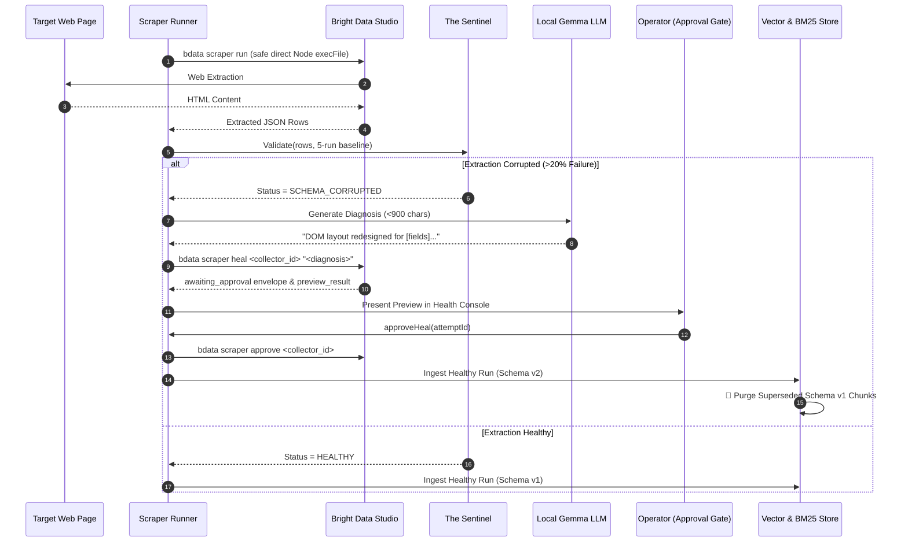

# AegisRAG — Autonomous Self-Healing Knowledge Pipeline & Verifiable RAG

[](https://github.com/adityayawalkar-personal/AegisRAG/actions/workflows/ci.yml)
[](https://opensource.org/licenses/MIT)
[](https://www.typescriptlang.org/)
[](https://brightdata.com/)
[](https://ai.google.dev/gemma)

> **A continuous accuracy validation and self-healing extraction pipeline that detects web schema drift, generates plain-language repair diagnoses via local Gemma LLMs, drives Bright Data Scraper Studio's generative AI healing with human-in-the-loop approval, and guarantees stale extractions are automatically purged from RAG vector and keyword indices.**

---

## 🎯 Executive Summary & The Problem

Standard Retrieval-Augmented Generation (RAG) systems silently fail when web targets update their DOM markup. Traditional scrapers extract `null` or malformed fields, polluting vector databases with hallucination-inducing noise.

**AegisRAG** solves this with a closed-loop reliability architecture:
1. **The Sentinel (Accuracy Layer)**: Continuously validates extractions against a rolling 5-run median baseline, catching subtle data drift, type violations, and bot walls (>50% duplicate rows).
2. **Autonomous Gemma Diagnosis**: When schema corruption is detected (>20% field failure), a local Gemma 4 E2B model generates a single plain-language sentence (<900 chars) describing the broken elements.
3. **Safe Bright Data Self-Healing**: Feeds the diagnosis into `bdata scraper heal` via direct Node binary execution with argument arrays, previews the regenerated extraction, and halts at a human-in-the-loop approval gate.
4. **Collector Concurrency Locking**: Employs in-memory mutex locking keyed by `collector_id` to block race conditions and prevent concurrent heals from overlapping.
5. **Self-Cleaning Knowledge Store**: Bumping schema versions atomically purges superseded extractions from both dense vector and Okapi BM25 indices, eliminating index drift.
6. **Verifiable Hybrid Retrieval**: Combines semantic embeddings and BM25 via Reciprocal Rank Fusion (RRF, $k=60$), expands chunks to parent sections, and deterministically enforces inline source citations with verified timestamps.

---

## 🏛️ System Architecture

AegisRAG is organized into four strictly decoupled architectural layers:

```
┌──────────────────────────────────────────────────────────────────────────────┐
│                            PRESENTATION LAYER                                │
│   • Next-Gen Dark Dashboard (Chat Q&A, Health Console, Incident Replay)     │
│   • Authenticated REST API (POST /api/query, /api/trigger-run, /api/heal)   │
└──────────────────────────────────────┬───────────────────────────────────────┘
                                       │
┌──────────────────────────────────────▼───────────────────────────────────────┐
│                            APPLICATION LAYER                                 │
│   • The Sentinel (Accuracy Validator, Rolling Median Baseline Engine)        │
│   • The Self-Healing Loop (Gemma Diagnosis, CLI Wrappers, Concurrency Lock)  │
│   • RAG Service (Prompt Sandboxing, Citation Verification, Refusal Gate)     │
└──────────────────────────────────────┬───────────────────────────────────────┘
                                       │
┌──────────────────────────────────────▼───────────────────────────────────────┐
│                              DOMAIN LAYER                                    │
│   • Multi-Source Registry & Zod Schemas (sources.json, sources.ts)           │
│   • Collector State Machine (HEALTHY → DEGRADED → HEALING → RECOVERED)      │
│   • 3-Strike Circuit Breaker (Locks to DEGRADED_PERMANENT on 3 failures)     │
│   • Structure-Preserving Chunker (~500 tokens / 100 overlap / parent_id)     │
│   • Pre-Embedding PII Filter (Emails, Phones, SSNs Redacted with Logging)    │
│   • Okapi BM25 Sparse Search Engine (k1 = 1.2, b = 0.75)                     │
└──────────────────────────────────────┬───────────────────────────────────────┘
                                       │
┌──────────────────────────────────────▼───────────────────────────────────────┐
│                         INFRASTRUCTURE LAYER                                 │
│   • Bright Data Scraper Studio CLI (@brightdata/cli@0.3.5)                   │
│   • Direct Node Binary Resolution (Zero Shell / cmd.exe Interpolation)       │
│   • Local Gemma 4 E2B Inference Server (8-bit GGUF via llama.cpp on :8081)   │
│   • Embedded SQLite Transactional Database (better-sqlite3 in WAL mode)      │
└──────────────────────────────────────────────────────────────────────────────┘
```

---

## 💻 Platform Support

- **Primary Tier**: Linux (Ubuntu 20.04+, Debian, Fedora, Alpine) and macOS (Apple Silicon & Intel).
- **Secondary Tier (Windows)**: Windows 10/11 is fully supported through direct `process.execPath` execution of the `@brightdata/cli` JavaScript distribution, enforcing `shell: false` across all platforms to eliminate `cmd.exe` argument-reinterpretation and shell-injection risks.

---

## 🛠️ How Bright Data Scraper Studio is Used

Bright Data's **Scraper Studio** provides generative AI-powered web scraper creation, execution, and dynamic healing. AegisRAG integrates with Scraper Studio through safe CLI wrappers:

### 1. CLI Commands Utilized
- `bdata scraper create "<prompt>" --url <target_url>`: Initializes a cloud scraper collector targeting web feeds.
- `bdata scraper run <collector_id> <target_url> --pretty`: Executes live web extractions and returns structured JSON payloads.
- `bdata scraper heal <collector_id> "<gemma_description>" --url <target_url> --pretty`: Feeds Gemma's plain-language diagnosis to Scraper Studio's generative AI to synthesize updated CSS selectors and browser automation logic.
- `bdata scraper approve <collector_id>`: Manually promotes a previewed heal to live production scraper status.
- `bdata scraper approve <collector_id> --reject`: Rejects a flawed heal, recording a strike against the circuit breaker.

### 2. AI Agent vs. Hand-Written Division of Labor
| Subsystem | What Bright Data Scraper Studio Generates | What We Built by Hand |
| :--- | :--- | :--- |
| **Web Scraping** | Dynamic browser execution scripts, CSS/XPath selector synthesis, CAPTCHA bypass, and cloud proxies. | CLI process isolation runner (`scraper-runner.ts`), timeout/429 transient retry handlers, and SQLite raw logging. |
| **Validation & Healing** | Interactive code repair candidates (`preview_result` envelope). | **The Sentinel** validation engine, 5-run median baseline comparison, 20% noise threshold, Gemma diagnosis prompt client, concurrency mutex lock, 3-strike circuit breaker, and state machine. |
| **RAG Knowledge Base** | N/A | Structure-preserving hierarchical chunker, PII redaction filter, Okapi BM25 index, schema invalidation purger, and RRF hybrid retrieval. |

### 3. The Self-Healing Pipeline Sequence


---

## 🚀 Quick Start & Setup

### Prerequisites
- **Node.js**: v18.20+ or v20.12+
- **Bright Data API Key** (Configured in `.env`)
- **API_AUTH_SECRET** (Generated on setup or configured in `.env`)

### One-Command Setup
Clone the repository and run the automated setup script:

```bash
# Clone repository
git clone https://github.com/adityayawalkar-personal/AegisRAG.git
cd AegisRAG

# Linux / macOS / Git Bash
chmod +x setup.sh
./setup.sh

# Windows (Command Prompt / PowerShell)
setup.bat
```

The setup script automatically:
1. Provisions `.env` from `.env.example` and generates a secure random `API_AUTH_SECRET`.
2. Creates the `data/` directory.
3. Installs pinned dependencies (`npm install`).
4. Seeds 5+ historical baseline runs into SQLite (`npm run seed`).
5. Runs the full test suite (48 tests).
6. Starts the API server & Dashboard on `http://localhost:3001`.

### Key CLI Commands
```bash
# Start Interactive Dashboard & REST API
npm run server

# Run End-to-End Sabotage & Self-Healing Walkthrough Demo
npm run demo

# Run Full Vitest Test Suite (48 tests)
npm test

# Run TypeScript Typecheck
npm run typecheck

# Run Single Scraper Extraction Loop
npm run runner
```

---

## 📊 Live Extraction Schema & Sample Output

AegisRAG targets dynamic developer trends and feeds (`https://github.com/trending` with collector `c_msytsxke2c5eegz5we`).

```json
[
  {
    "repo_name": "facebook/react",
    "author": "facebook",
    "description": "The library for web and native user interfaces.",
    "stars_today": "1,200 stars today",
    "total_stars": "235,000",
    "language": "JavaScript",
    "url": "https://github.com/facebook/react"
  },
  {
    "repo_name": "vercel/next.js",
    "author": "vercel",
    "description": "The React Framework for the Web.",
    "stars_today": "850 stars today",
    "total_stars": "128,000",
    "language": "TypeScript",
    "url": "https://github.com/vercel/next.js"
  }
]
```

---

## 🤖 AI Tool-Use & Authorship Disclosure

In the spirit of transparent engineering, the following table details the authorship and generation method for each module:

| File / Module | Authorship Category | Description & Human Customization |
| :--- | :--- | :--- |
| `src/sentinel/sentinel.ts` | **Heavily Edited by Us** | Modular rule aggregator enforcing the 20% corruption threshold and SQLite reporting. |
| `src/sentinel/rules/*.ts` | **Hand-Written by Us** | Four standalone validation rules (type/range, 5-run median baseline, soft-failure clustering, structured data cross-check). |
| `src/sentinel/similarity.ts` | **Hand-Written by Us** | Pure TypeScript Dice similarity and token-overlap duplicate clustering for CAPTCHA wall detection. |
| `src/healing/state-machine.ts`| **Hand-Written by Us** | Formal state transition graph (`HEALTHY → DEGRADED → HEALING → RECOVERED → DEGRADED_PERMANENT`). |
| `src/healing/circuit-breaker.ts`| **Hand-Written by Us** | 3-strike failure tracking and lockout protection. |
| `src/healing/failure-classifier.ts`| **Hand-Written by Us** | Smart retry router with exponential backoff on 429/5xx/timeouts before healing. |
| `src/healing/gemma-client.ts` | **Heavily Edited by Us** | Local Gemma inference client enforcing single-sentence <900 character repair prompts with XML delimiter framing. |
| `src/healing/heal-loop.ts` | **Hand-Written by Us** | Safe direct Node CLI wrappers (`shell: false`), collector concurrency mutex locking, with manual `approveHeal`/`rejectHeal` gates. |
| `src/indexing/chunking.ts` | **Hand-Written by Us** | Structure-preserving hierarchical section parser (~500 tokens / 100 overlap). |
| `src/indexing/pii-filter.ts` | **Hand-Written by Us** | Regex PII redaction (email, phone, SSN) before embedding. |
| `src/indexing/bm25.ts` | **Hand-Written by Us** | Pure TypeScript Okapi BM25 keyword search engine. |
| `src/indexing/index-store.ts` | **Hand-Written by Us** | Dual store manager with Sentinel quality gate and automatic stale-chunk purging. |
| `src/retrieval/retrieve.ts` | **Hand-Written by Us** | Parallel vector + BM25 search with Reciprocal Rank Fusion (RRF) and parent expansion. |
| `src/retrieval/rag-service.ts`| **Hand-Written by Us** | Sandboxed prompt template and deterministic post-generation citation verification. |
| `src/server/app.ts` & `auth.ts` | **Hand-Written by Us** | Native Node.js REST API with strict startup secret validation (`getAuthSecret()`). |
| `public/*` | **Heavily Edited by Us** | Modern dark-theme dashboard (Chat, Health Console, Incident Replay) with XSS sanitization and client-side token caching. |
| `tests/*.test.ts` (13 suites) | **Heavily Edited by Us** | 48 automated unit tests covering all edge cases, synthetic failures, concurrency locking, and RAG pipelines. |

---

## 🔮 Production Readiness & Scoped-Out Features

AegisRAG was architected for maximum reliability under hackathon judging conditions. Several advanced capabilities were deliberately scoped out to ensure rock-solid core execution:

| Scoped-Out Feature | Technical Rationale for Scoping Out | Production Path Forward |
| :--- | :--- | :--- |
| **Knowledge Graph RAG (GraphRAG)** | Graph construction over dynamically changing HTML introduces entity resolution latency (>15s per ingestion). | Implement async background entity extraction via Neo4j / Memgraph once raw extractions stabilize. |
| **Multi-Hop Agentic Retrieval Loops** | Unconstrained multi-step agent reasoning can loop infinitely during benchmark evaluation. | Implement bounded 2-step ReAct retrieval with deterministic early-stopping criteria. |
| **Distributed Vector Store (Qdrant / Chroma Cloud)** | Adding external cloud network dependencies introduces network latency and authentication points of failure during judging. | Swap local SQLite `chunks_index` vector store with Qdrant Cloud via the existing `IndexStore` interface. |
| **Long-Term User Memory** | User session state is orthogonal to the core challenge of web scraping self-healing. | Store conversational session checkpoints in SQLite. |

---

## 🛡️ Standing Safety & Security Rules

All operations in this codebase strictly adhere to these 5 boundaries:
1. **Safe CLI Invocations**: CLI calls use direct Node binary invocation (`shell: false`) with argument arrays — eliminating `cmd.exe` interpolation and shell-injection risks.
2. **Strict Secrets Hygiene**: Zero credentials in git; `.env` is strictly git-ignored; startup fails fast if `API_AUTH_SECRET` is unset.
3. **Manual Heal Approval Gate**: `--auto-approve` is never passed to CLI commands; operator approval remains mandatory.
4. **Auth / Permission Fault Handling**: Immediate halt on permission errors without privilege escalation.
5. **Untrusted Data Isolation**: Scraped web text and diff summaries are wrapped in explicit delimiter tags and treated strictly as passive reference data.

---

## 📜 License
MIT License © 2026 Aditya Yawalkar.
