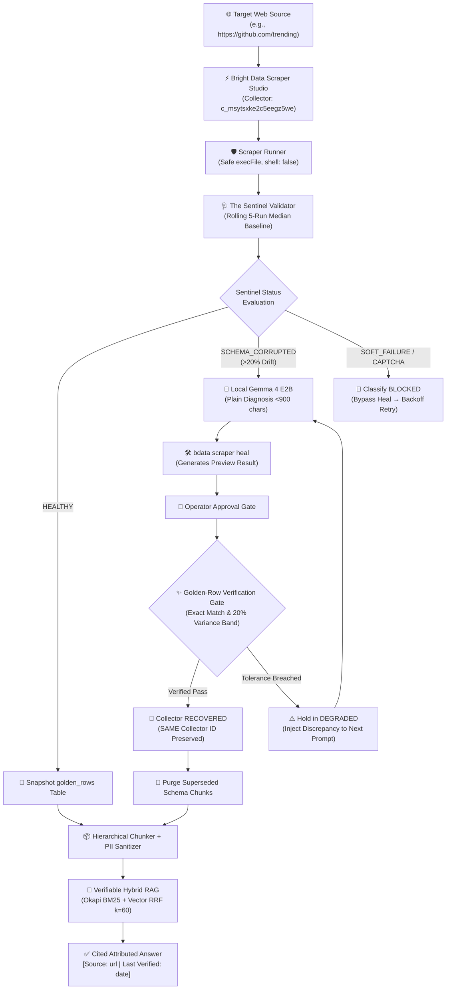

# AegisRAG — System Architecture & Division of Labor

A high-reliability, self-healing web extraction pipeline connecting **Bright Data Scraper Studio** to a **Verifiable RAG Knowledge Engine**.

---

## 1. One-Page Architecture Flowchart

---

## 2. Division of Labor: Bright Data vs. Hand-Built AegisRAG

To ensure clear authorship and code ownership boundaries:

| Architectural Layer | Subsystem / Responsibility | What Bright Data Scraper Studio Provides | What Was Hand-Built by Developer (Aditya Yawalkar) |
| :--- | :--- | :--- | :--- |
| **Ingestion & Browser Execution** | Headless cloud browsers, proxy rotation, and dynamic JavaScript execution | ✅ Full cloud infrastructure & Scraper Studio collector (`c_msytsxke2c5eegz5we`) | 🛠️ Argument-array process runner (`execFile`, `shell: false`), timeout killer, and SQLite run logger |
| **Accuracy Validation** | Multi-run baseline tracking, noise thresholding, and bot challenge classification | ❌ None (CLI returns raw JSON without semantic validation) | 🛠️ **The Sentinel** validation engine, 4 modular rule plugins, rolling 5-run median baselines, and `BLOCKED` routing |
| **AI Diagnosis & Repair** | Selector regeneration and interactive heal preview generation | ✅ Generative AI selector synthesis via `bdata scraper heal` | 🛠️ Local Gemma 4 E2B prompt client (<900 char sandboxing), failure diff extraction, and provenance tracking |
| **Quality Gating & Governance** | Safety approval, circuit breaking, and semantic tolerance verification | ❌ None | 🛠️ Post-heal **Golden-Row Verification Gate** (structural key match + 20% variance band), 3-strike circuit breaker, and state machine |
| **Downstream Knowledge Layer** | Hierarchical chunking, PII redaction, search ranking, and citations | ❌ None | 🛠️ Structure-preserving chunker, regex PII filter, from-scratch Okapi BM25 engine, RRF fusion, timestamp citation parser, and refusal gate |

---

## 3. Core Conceptual Distinction

> **Bright Data Scraper Studio** repairs the scraper code.  
> **AegisRAG** decides whether the resulting data is actually trustworthy before it is allowed to touch downstream AI.
